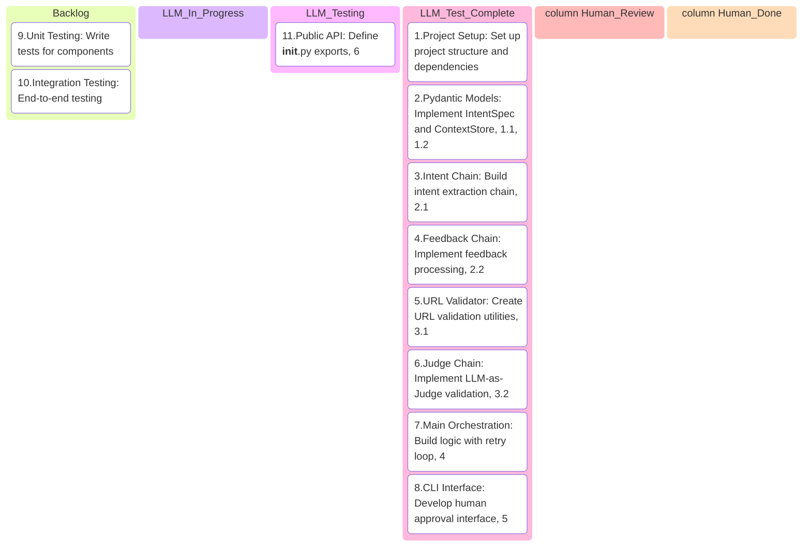

# [module] Intent Inference - Implementation Plan



**Module Overview (MVP Scope):**

The Intent Inference module, for this MVP, translates a user's natural language text input into a standardized `IntentSpec` Pydantic v2 model. It iteratively refines this specification based on self-critique (LLM-as-a-Judge) and user feedback. If the LLM-as-a-Judge identifies issues that require human input, it will flag the `IntentSpec` accordingly. The module's primary goal is to produce an `IntentSpec` that accurately captures user requirements, including basic URL validation. **Before this `IntentSpec` is passed to a subsequent module (e.g., "Scout"), it MUST be presented to a human operator for review and explicit approval, especially if it required clarification.**

**Key MVP Principles:**

1. **Graph Adherence:** All components and flows in the provided mermaid graph are the target.
2. **LangChain Expression Language (LCEL):** All chains built using LCEL from `langchain-core` and relevant LangChain packages.
3. **Pydantic v2 Models:** All custom data schemas (`ContextStore`, `IntentSpec`, LLM-related schemas) defined using Pydantic v2 syntax.
4. **Explicit Context Management:** The `ContextStore` is central and explicitly managed.
5. **LLM-as-a-Judge Validation Loop:** Self-correction mechanism is core.
6. **User Feedback Loop:** Ability to process feedback to refine an intent is core.
7. **URL Health Check (Basic):** Confirm basic reachability of URLs identified in the `IntentSpec`.
8. **No Bells & Whistles:** Stick to the core graph functionality.
9. Human-in-the-Loop (HITL) for Clarification & Final Approval:
   - If the module determines clarification is needed, this will be explicitly indicated in the output.
   - The final `IntentSpec` (even if "validated_by_llm_judge") will be presented to a human for review and approval before being considered ready for "Scout." (For MVP, this might be a manual check of the JSON output).

```python

the-brain-ai-scraper-2/
└── intent_inference/
    ├── __init__.py               # Public API
    ├── main.py                   # Chain orchestration & high-level API
    ├── models/
    │   ├── __init__.py
    │   ├── intent_spec.py        # IntentSpec model
    │   └── context.py            # ContextStore implementation
    ├── chains/
    │   ├── __init__.py
    │   ├── intent_chain.py       # New intent extraction 
    │   ├── feedback_chain.py     # Feedback processing
    │   └── validation_chain.py   # Validation with LLM-as-Judge
    ├── prompts/
    │   ├── __init__.py
    │   ├── intent_prompts.py     # Intent extraction prompts
    │   ├── feedback_prompts.py   # Feedback processing prompts
    │   └── validation_prompts.py # Validation prompts
    ├── utils/
    │   ├── __init__.py
    │   ├── url_validator.py      # URL health checking
    │   └── chain_helpers.py      # Shared chain utilities
    └── cli.py                    # Command-line interface with human approval


```




```mermaid
graph TD
    %% Context store
    subgraph Memory
        Context["Context Store\n(user_query, critique_hints, last_spec)"]
    end

    %% Input routing
    UserInputText["User Input (Text)"] --> Context
    Context --> BranchLogic{"Decision: New vs Feedback"}

    BranchLogic -- "New Intent"  --> IntentLLMProcessing["Process as New Intent (LLM Chain)"]
    BranchLogic -- "Feedback"    --> FeedbackLLMProcessing["Process as Feedback (LLM Chain)"]

    %% New Intent path
    subgraph IntentLLMProcessing
        direction LR
        Context --> IP_Prompt["Intent Prompt Template"]
        IP_Prompt --> IP_LLM["LLM Call"]
        IP_LLM --> IP_OutputParser["Pydantic Parser (LLMIntentSpec)"]
        IP_OutputParser --> IP_LLMStructuredOutput["LLMIntentSpecSchema"]
    end
    IP_LLMStructuredOutput --> PostProcessIntent["Code: Normalize → IntentSpec"]

    %% Feedback path
    subgraph FeedbackLLMProcessing
        direction LR
        Context --> FB_Prompt["Feedback Prompt Template"]
        FB_Prompt --> FB_LLM["LLM Call"]
        FB_LLM --> FB_OutputParser["Pydantic Parser (LLMFeedback)"]
        FB_OutputParser --> FB_LLMStructuredOutput["LLMFeedbackSchema"]
    end
    FB_LLMStructuredOutput --> PostProcessFeedback["Code: Apply → IntentSpec Update"]

    %% Merge spec outputs
    PostProcessIntent --> FinalIntentSpecOut["IntentSpec"]
    PostProcessFeedback --> FinalIntentSpecOut

    %% Update context with latest spec
    FinalIntentSpecOut --> UpdateContext["Update Context.last_spec"]
    UpdateContext --> ValidationChain["Validation Chain"]

    %% Validation subgraph
    subgraph Validation
        direction TB
        ValidationChain --> JudgePrompt["ReflectionChain: Judge Prompt"]
        JudgePrompt --> JudgeLLM["LLM-as-Judge Call"]
        JudgeLLM --> JudgeParser["Parse: is_valid & issues"]
        JudgeParser --> URLHealth["URL Health Check Runnable"]
        URLHealth --> Decision{"Spec Valid & URLs OK?"}
    end

    %% Decision paths
    Decision -->|Yes| HumanReview["Human Review"]
    Decision -->|No| AddCritique["Add Critique to Context"]
    
    %% Retry path loops back to decision via context
    AddCritique --> UpdateHints["Update Context.critique_hints"]
    UpdateHints --> Context
    
    %% Human review path
    HumanReview --> HumanDecision{"Approved?"}
    HumanDecision -->|Yes| Return["Return Validated Spec"]
    HumanDecision -->|No| HumanFeedback["Convert to Feedback"]
    HumanFeedback --> Context
    
    %% Successful path
    Return --> OutputToOrchestrator["Return to Orchestrator"]

    %% Styling
    classDef decision fill:#fcf3cf,stroke:#333;
    classDef process  fill:#e6f3ff,stroke:#333;
    classDef code     fill:#f0f0f0,stroke:#333;
    classDef data     fill:#f0f0f0,stroke:#333;
    classDef llmchain fill:#f9f9f9,stroke:#555,stroke-dasharray:5 2;
    classDef human    fill:#d4f5e6,stroke:#333;

    class BranchLogic,Decision,HumanDecision decision
    class IP_LLMStructuredOutput,FB_LLMStructuredOutput,FinalIntentSpecOut data
    class IntentLLMProcessing,FeedbackLLMProcessing llmchain
    class IP_Prompt,IP_LLM,IP_OutputParser,FB_Prompt,FB_LLM,FB_OutputParser,JudgePrompt,JudgeLLM code
    class PostProcessIntent,PostProcessFeedback,URLHealth,UpdateContext,UpdateHints,ValidationChain,AddCritique process
    class HumanReview,HumanFeedback human


```

## Implementation plan

### 1. Pydantic Models Implementation

#### 1.1 IntentSpec Model (models/intent_spec.py)

python


```python
from typing import List, Dict, Any, Optional
from pydantic import BaseModel, Field, field_validator
import uuid

class ExtractedField(BaseModel):
    field_name: str = Field(..., description="Name of the field to extract")
    description: str = Field(..., description="Description of what this field represents")

class IntentSpec(BaseModel):
    spec_id: str = Field(default_factory=lambda: f"intent_{uuid.uuid4().hex[:8]}")
    original_user_query: str = Field(..., description="Original user query that created this spec")
    target_urls_or_sites: List[str] = Field(..., description="Target websites or URLs")
    data_to_extract: List[ExtractedField] = Field(..., description="Data fields to extract") 
    constraints: Dict[str, Any] = Field(default_factory=dict, description="Additional constraints")
    url_health_status: Dict[str, str] = Field(default_factory=dict)
    validation_status: str = Field(default="pending", description="Status of validation")
    critique_history: Optional[List[str]] = Field(default=None, description="Validation issues")
    
    @field_validator('spec_id')
    @classmethod
    def validate_spec_id(cls, v, info):
        if 'last_spec' in info.data and info.data['last_spec'] and '_rev' not in v:
            return f"{v}_rev1"
        return v
```

#### 1.2 Context Store (models/context.py)

python


```python
from typing import List, Optional, Dict, Any
from .intent_spec import IntentSpec
from pydantic import BaseModel, Field

class ContextStore(BaseModel):
    """Maintains state throughout the intent inference process"""
    user_query: str = ""
    critique_hints: List[str] = Field(default_factory=list)
    last_spec: Optional[IntentSpec] = None
    
    def update_query(self, query: str) -> None:
        self.user_query = query
        
    def update_spec(self, spec: IntentSpec) -> None:
        self.last_spec = spec
        
    def add_critique(self, issues: List[str]) -> None:
        self.critique_hints.extend(issues)
        
    def clear_critiques(self) -> None:
        self.critique_hints = []
```

### 2. Core Chain Implementation

#### 2.1 Intent Extraction Chain (chains/intent_chain.py)

python


```python
from langchain_core.prompts import ChatPromptTemplate
from langchain_core.output_parsers import PydanticOutputParser
from langchain_core.runnables import RunnablePassthrough
from langchain_openai import ChatOpenAI
from app.intent_inference.models.intent_spec import IntentSpec

# Intent extraction prompt
INTENT_SYSTEM_PROMPT = """You are an expert at understanding web scraping requirements.
Extract structured information from the user's request without implementation details."""

INTENT_USER_PROMPT = """
Based on this request: {user_query}

{critique_hints_formatted}

Extract the following information:
1. The target websites or URLs
2. The specific data fields to extract
3. Any constraints or filters

Format your response as a JSON object following this structure:
{intent_format_instructions}
"""

def format_critique_hints(context):
    hints = context.critique_hints
    if not hints:
        return ""
    return "Previous issues to address:\n" + "\n".join([f"- {h}" for h in hints])

def create_intent_chain():
    llm = ChatOpenAI(temperature=0.1, model="gpt-4")
    intent_parser = PydanticOutputParser(pydantic_object=IntentSpec)
    
    intent_prompt = ChatPromptTemplate.from_messages([
        ("system", INTENT_SYSTEM_PROMPT),
        ("human", INTENT_USER_PROMPT.format(
            intent_format_instructions=intent_parser.get_format_instructions()))
    ])
    
    return (
        RunnablePassthrough.assign(
            critique_hints_formatted=lambda x: format_critique_hints(x)
        )
        | intent_prompt 
        | llm 
        | intent_parser
    )
```

#### 2.2 Feedback Processing Chain (chains/feedback_chain.py)

python


```python
from langchain_core.prompts import ChatPromptTemplate
from langchain_core.output_parsers import PydanticOutputParser
from langchain_core.runnables import RunnablePassthrough
from langchain_openai import ChatOpenAI
from app.intent_inference.models.intent_spec import IntentSpec

# Feedback processing prompt
FEEDBACK_SYSTEM_PROMPT = """You are an expert at applying user feedback to existing web scraping specifications."""

FEEDBACK_USER_PROMPT = """
The user has an existing specification:
{last_spec_formatted}

And has provided this feedback:
{user_query}

{critique_hints_formatted}

Determine what changes are needed to the specification.
Your response should be a complete, updated specification following this structure:
{feedback_format_instructions}
"""

def format_last_spec(context):
    if not context.last_spec:
        return "No previous specification exists."
    return context.last_spec.model_dump_json(indent=2)

def create_feedback_chain():
    llm = ChatOpenAI(temperature=0.1, model="gpt-4")
    feedback_parser = PydanticOutputParser(pydantic_object=IntentSpec)
    
    feedback_prompt = ChatPromptTemplate.from_messages([
        ("system", FEEDBACK_SYSTEM_PROMPT),
        ("human", FEEDBACK_USER_PROMPT.format(
            feedback_format_instructions=feedback_parser.get_format_instructions()))
    ])
    
    return (
        RunnablePassthrough.assign(
            last_spec_formatted=lambda x: format_last_spec(x),
            critique_hints_formatted=lambda x: format_critique_hints(x)
        )
        | feedback_prompt 
        | llm 
        | feedback_parser
    )
```

### 3. Validation Implementation

#### 3.1 URL Validator (utils/url_validator.py)

python


```python
import httpx
from typing import Dict, Any

async def check_url_health(url: str) -> Dict[str, Any]:
    """Perform basic health check on URL"""
    # Add scheme if missing
    if not url.startswith(('http://', 'https://')):
        url = f"https://{url}"
    
    try:
        async with httpx.AsyncClient() as client:
            response = await client.head(
                url, 
                timeout=5, 
                follow_redirects=True
            )
        if response.status_code >= 400:
            return {
                "success": False, 
                "issue": f"URL returned status code {response.status_code}"
            }
        return {"success": True}
    except Exception as e:
        return {"success": False, "issue": f"URL check failed: {str(e)}"}

async def validate_urls(spec):
    """Validate all URLs in an IntentSpec"""
    result = {}
    for url in spec.target_urls_or_sites:
        check_result = await check_url_health(url)
        if check_result["success"]:
            result[url] = "healthy"
        else:
            result[url] = check_result["issue"]
    return result
```

#### 3.2 Validation Chain (chains/validation_chain.py)

python


```python
from langchain_core.prompts import ChatPromptTemplate
from langchain_core.runnables import RunnablePassthrough
from langchain_openai import ChatOpenAI
from pydantic import BaseModel, Field
from typing import List, Optional
from app.intent_inference.utils.url_validator import validate_urls

class ValidationResult(BaseModel):
    valid: bool = Field(..., description="Whether the spec is valid")
    issues: Optional[List[str]] = Field(default=None, description="Issues found")

JUDGE_SYSTEM_PROMPT = """You are a critical judge evaluating a web scraping specification.
Your job is to identify any flaws, inconsistencies, or missing information."""

JUDGE_USER_PROMPT = """
Evaluate this web scraping specification for completeness and validity:
{intent_spec_formatted}

Your evaluation should consider:
1. Is the specification sufficiently detailed?
2. Are the fields to be scraped clearly defined?
3. Are there any logical inconsistencies or impossible requirements?
4. Is the target website clearly specified?
5. Are constraints clear enough for implementation?

Respond with a JSON object containing:
1. A boolean "valid" (true/false)
2. An array of "issues" if any were found (empty array if none)
"""

def format_intent_spec(intent_spec):
    return intent_spec.model_dump_json(indent=2)

def create_validation_chain():
    llm = ChatOpenAI(temperature=0, model="gpt-4")
    
    judge_prompt = ChatPromptTemplate.from_messages([
        ("system", JUDGE_SYSTEM_PROMPT),
        ("human", JUDGE_USER_PROMPT)
    ])
    
    # LLM Judge Chain
    judge_chain = (
        RunnablePassthrough.assign(
            intent_spec_formatted=lambda x: format_intent_spec(x)
        )
        | judge_prompt
        | llm
        | lambda x: ValidationResult.model_validate_json(x)
    )
    
    # Full validation chain with URL checking
    async def validate_full(intent_spec):
        # First get LLM validation
        validation = await judge_chain.ainvoke(intent_spec)
        
        # If already invalid, return early
        if not validation.valid:
            intent_spec.validation_status = "needs_revision"
            if validation.issues:
                intent_spec.critique_history = validation.issues
            return validation, intent_spec
        
        # Check URLs if spec passed LLM validation
        url_status = await validate_urls(intent_spec)
        intent_spec.url_health_status = url_status
        
        # Check if any URLs are unhealthy
        unhealthy_urls = [url for url, status in url_status.items() 
                          if status != "healthy"]
        
        if unhealthy_urls:
            validation.valid = False
            validation.issues = validation.issues or []
            for url in unhealthy_urls:
                validation.issues.append(
                    f"URL '{url}' is not reachable: {url_status[url]}"
                )
            intent_spec.validation_status = "needs_revision"
            intent_spec.critique_history = validation.issues
        else:
            intent_spec.validation_status = "validated"
        
        return validation, intent_spec
    
    return validate_full
```

### 4. Main Orchestration (main.py)

python


```python
from langchain_core.runnables import RunnableBranch
from app.intent_inference.models.context import ContextStore
from app.intent_inference.models.intent_spec import IntentSpec
from app.intent_inference.chains.intent_chain import create_intent_chain
from app.intent_inference.chains.feedback_chain import create_feedback_chain
from app.intent_inference.chains.validation_chain import create_validation_chain
import asyncio
import uuid
import json
from typing import Tuple, Union, List, Dict, Any, Optional

class IntentInferenceAgent:
    """Main agent for intent inference with human approval"""
    
    def __init__(self, context_store=None):
        self.context_store = context_store or ContextStore()
        self.intent_chain = create_intent_chain()
        self.feedback_chain = create_feedback_chain()
        self.validation_chain = create_validation_chain()
    
    def is_feedback(self, context: ContextStore) -> bool:
        """Determine if input is feedback to an existing spec"""
        feedback_indicators = ["change", "update", "modify", "instead", 
                               "rather", "not", "fix", "add", "remove"]
        
        # No previous spec means it can't be feedback
        if not context.last_spec:
            return False
            
        # Check for feedback indicator words
        for word in feedback_indicators:
            if word in context.user_query.lower():
                return True
                
        return False
    
    async def process_input(self, context: ContextStore) -> IntentSpec:
        """Process input through either intent or feedback chain"""
        branch = RunnableBranch(
            (self.is_feedback, self.feedback_chain),
            (lambda _: True, self.intent_chain)
        )
        
        # Run appropriate chain
        result = await branch.ainvoke(context)
        
        # Ensure result has proper spec_id
        if context.last_spec and "rev" not in result.spec_id:
            # Create a revision ID
            prev_revs = [int(s.split("rev")[1]) for s in context.last_spec.spec_id.split("_") 
                         if "rev" in s and s.split("rev")[1].isdigit()]
            rev_num = max(prev_revs) + 1 if prev_revs else 1
            base_id = result.spec_id.split("_rev")[0] if "_rev" in result.spec_id else result.spec_id
            result.spec_id = f"{base_id}_rev{rev_num}"
            
        # Set original query if not present
        if not result.original_user_query:
            result.original_user_query = context.user_query
            
        return result
    
    async def validate_intent(self, intent_spec: IntentSpec) -> Tuple[bool, IntentSpec]:
        """Validate intent spec using the validation chain"""
        validation_result, updated_spec = await self.validation_chain(intent_spec)
        return validation_result.valid, updated_spec
    
    async def infer_intent(self, user_input: str, max_attempts: int = 3) -> Tuple[IntentSpec, bool]:
        """Main method to infer intent with validation and retry"""
        # Update context with user query
        self.context_store.update_query(user_input)
        
        for attempt in range(max_attempts):
            # Process input
            intent_spec = await self.process_input(self.context_store)
            
            # Validate intent
            is_valid, updated_spec = await self.validate_intent(intent_spec)
            
            # Update context with processed spec
            self.context_store.update_spec(updated_spec)
            
            if is_valid:
                # Success - clear critiques and return
                self.context_store.clear_critiques()
                return updated_spec, True
            else:
                # Add validation issues to context for retry
                critique_hints = updated_spec.critique_history or []
                self.context_store.add_critique(critique_hints)
                
                # If this is the last attempt, return best effort
                if attempt == max_attempts - 1:
                    return updated_spec, False
        
        # This should never be reached with the current implementation
        return self.context_store.last_spec, False
    
    def present_for_approval(self, intent_spec: IntentSpec) -> Tuple[bool, Optional[str]]:
        """Present the intent spec to a human for approval"""
        print("\n===== INTENT SPECIFICATION FOR APPROVAL =====")
        formatted_json = json.dumps(intent_spec.model_dump(), indent=2)
        print(formatted_json)
        print("\n===========================================")
        
        choice = input("\nApprove this specification? (y/n): ").lower()
        
        if choice.startswith('y'):
            return True, None
        else:
            feedback = input("Please provide feedback to improve the specification:\n")
            return False, feedback
    
    async def run_with_approval(self, user_input: str) -> Optional[IntentSpec]:
        """Run the full inference process with human approval"""
        spec, is_valid = await self.infer_intent(user_input)
        
        if not is_valid:
            print("WARNING: Validation failed, but presenting best effort result.")
            
        approved, feedback = self.present_for_approval(spec)
        
        if approved:
            return spec
        elif feedback:
            # Process the feedback and try again
            return await self.run_with_approval(feedback)
        else:
            print("Operation cancelled.")
            return None

# Synchronous wrapper for easier integration
def infer_intent_sync(user_input: str) -> Optional[IntentSpec]:
    """Synchronous version of the intent inference process"""
    agent = IntentInferenceAgent()
    return asyncio.run(agent.run_with_approval(user_input))
```

### 5. CLI Interface (cli.py)

python


```python
import argparse
import asyncio
import json
from app.intent_inference.main import IntentInferenceAgent

async def main():
    parser = argparse.ArgumentParser(description="Intent Inference CLI")
    parser.add_argument("query", help="User query to process", nargs="?")
    parser.add_argument("--file", "-f", help="Path to file containing user query")
    args = parser.parse_args()
    
    # Get user query from args or file
    user_query = args.query
    if args.file:
        with open(args.file, 'r') as f:
            user_query = f.read().strip()
    
    # If no query provided, prompt user
    if not user_query:
        user_query = input("Enter your scraping request: ")
    
    # Process the query
    agent = IntentInferenceAgent()
    result = await agent.run_with_approval(user_query)
    
    if result:
        # Write to file and display
        with open("intent_spec.json", "w") as f:
            json.dump(result.model_dump(), f, indent=2)
        print(f"\nIntent specification saved to intent_spec.json")
        return 0
    else:
        print("No valid intent specification was produced.")
        return 1

if __name__ == "__main__":
    exit_code = asyncio.run(main())
    exit(exit_code)
```

### 6. Public API (**init**.py)

python


```python
from app.intent_inference.main import IntentInferenceAgent, infer_intent_sync
from app.intent_inference.models.intent_spec import IntentSpec

__all__ = ["IntentInferenceAgent", "infer_intent_sync", "IntentSpec"]
```


## Intent Inference Examples

### Example 1: E-commerce Product Information

**User Input:**
```
I need information about Samsung TVs on BestBuy, including prices and customer reviews.
```

**JSON Output:**
```json
{
  "spec_id": "intent_23491",
  "original_user_query": "I need information about Samsung TVs on BestBuy, including prices and customer reviews.",
  "target_urls_or_sites": ["bestbuy.com"],
  "data_to_extract": [
    {"field_name": "product_name", "description": "Full name of the Samsung TV model"},
    {"field_name": "price", "description": "Current selling price"},
    {"field_name": "customer_rating", "description": "Average star rating from customers"},
    {"field_name": "review_count", "description": "Number of customer reviews"}
  ],
  "constraints": {
    "brand": "Samsung",
    "product_category": "TVs"
  },
  "url_health_status": {"bestbuy.com": "healthy"},
  "validation_status": "validated",
  "critique_history": null
}
```

## Example 2: Job Search with Time Constraint

**User Input:**
```
I want to find the latest job postings of the last 30 days on LinkedIn and Indeed for Product Manager roles in Montreal.
```

**JSON Output:**
```json
{
  "spec_id": "intent_78532",
  "original_user_query": "I want to find the latest job postings of the last 30 days on LinkedIn and Indeed for Product Manager roles in Montreal.",
  "target_urls_or_sites": ["linkedin.com", "indeed.com"],
  "data_to_extract": [
    {"field_name": "job_title", "description": "Title of the job posting"},
    {"field_name": "company_name", "description": "Name of the hiring company"},
    {"field_name": "location", "description": "Job location details"},
    {"field_name": "posting_date", "description": "When the job was posted"},
    {"field_name": "job_description", "description": "Full description of the job"},
    {"field_name": "salary_info", "description": "Salary information if available"}
  ],
  "constraints": {
    "job_role": "Product Manager",
    "location": "Montreal",
    "time_constraint": {
      "lookback_period": "last 30 days"
    }
  },
  "url_health_status": {
    "linkedin.com": "healthy",
    "indeed.com": "healthy"
  },
  "validation_status": "validated",
  "critique_history": null
}
```

### Example 3: Vague Request Requiring Clarification

**User Input:**
```
Get stock prices from Yahoo
```

**Initial Processing:**
```json
{
  "spec_id": "intent_34215",
  "original_user_query": "Get stock prices from Yahoo",
  "target_urls_or_sites": ["finance.yahoo.com"],
  "data_to_extract": [
    {"field_name": "stock_price", "description": "Current stock price"},
    {"field_name": "stock_symbol", "description": "Stock ticker symbol"},
    {"field_name": "company_name", "description": "Name of the company"}
  ],
  "constraints": {},
  "url_health_status": {"finance.yahoo.com": "healthy"},
  "validation_status": "needs_clarification",
  "critique_history": [
    "Query is too vague - which specific stocks should be tracked?",
    "No time period or frequency of price updates specified"
  ]
}
```

**After User Clarification:**
```
I want daily closing prices for Apple, Microsoft, and Google for the past month from Yahoo Finance
```

**Updated JSON Output:**
```json
{
  "spec_id": "intent_34215_rev1",
  "original_user_query": "I want daily closing prices for Apple, Microsoft, and Google for the past month from Yahoo Finance",
  "target_urls_or_sites": ["finance.yahoo.com"],
  "data_to_extract": [
    {"field_name": "stock_symbol", "description": "Stock ticker symbol (AAPL, MSFT, GOOGL)"},
    {"field_name": "company_name", "description": "Name of the company"},
    {"field_name": "closing_price", "description": "Stock closing price for each day"},
    {"field_name": "date", "description": "Date of the stock price"}
  ],
  "constraints": {
    "stocks": ["AAPL", "MSFT", "GOOGL"],
    "time_constraint": {
      "lookback_period": "past month"
    },
    "price_type": "closing",
    "frequency": "daily"
  },
  "url_health_status": {"finance.yahoo.com": "healthy"},
  "validation_status": "validated",
  "critique_history": [
    "Query is too vague - which specific stocks should be tracked?",
    "No time period or frequency of price updates specified"
  ]
}
```

### Example 4: Feedback Processing

**Original Intent Spec:**
```json
{
  "spec_id": "intent_92156",
  "original_user_query": "Find top 10 trending movies on Rotten Tomatoes",
  "target_urls_or_sites": ["rottentomatoes.com"],
  "data_to_extract": [
    {"field_name": "movie_title", "description": "Title of the movie"},
    {"field_name": "tomatometer", "description": "Rotten Tomatoes critic score"},
    {"field_name": "release_date", "description": "When the movie was released"}
  ],
  "constraints": {
    "list_type": "trending",
    "limit": 10
  },
  "url_health_status": {"rottentomatoes.com": "healthy"},
  "validation_status": "validated",
  "critique_history": null
}
```

**User Feedback:**
```
Also include audience score and genre information, and change it to top 20 movies
```

**Updated JSON Output:**
```json
{
  "spec_id": "intent_92156_rev1",
  "original_user_query": "Find top 10 trending movies on Rotten Tomatoes",
  "target_urls_or_sites": ["rottentomatoes.com"],
  "data_to_extract": [
    {"field_name": "movie_title", "description": "Title of the movie"},
    {"field_name": "tomatometer", "description": "Rotten Tomatoes critic score"},
    {"field_name": "audience_score", "description": "Audience rating percentage"},
    {"field_name": "genre", "description": "Movie genre(s)"},
    {"field_name": "release_date", "description": "When the movie was released"}
  ],
  "constraints": {
    "list_type": "trending",
    "limit": 20
  },
  "url_health_status": {"rottentomatoes.com": "healthy"},
  "validation_status": "validated",
  "critique_history": null
}
```

### Example 5: Multiple Sites for Comparison

**User Input:**
```
Compare prices of the iPhone 14 Pro from Apple, Amazon, Best Buy, and Walmart
```

**JSON Output:**
```json
{
  "spec_id": "intent_45678",
  "original_user_query": "Compare prices of the iPhone 14 Pro from Apple, Amazon, Best Buy, and Walmart",
  "target_urls_or_sites": ["apple.com", "amazon.com", "bestbuy.com", "walmart.com"],
  "data_to_extract": [
    {"field_name": "product_name", "description": "Full product name including storage size and color variants"},
    {"field_name": "price", "description": "Current selling price"},
    {"field_name": "store", "description": "Retailer name"},
    {"field_name": "availability", "description": "In stock status"},
    {"field_name": "shipping_info", "description": "Shipping cost and estimated delivery"}
  ],
  "constraints": {
    "product": "iPhone 14 Pro",
    "comparison_type": "price"
  },
  "url_health_status": {
    "apple.com": "healthy",
    "amazon.com": "healthy",
    "bestbuy.com": "healthy",
    "walmart.com": "healthy"
  },
  "validation_status": "validated",
  "critique_history": null
}
```

These examples focus on clearly specifying what data needs to be extracted without implementation details. The Scout tool can then use this intent specification to figure out the specific URLs, selectors, and handle any technical challenges like JavaScript requirements or pagination.

The format provides enough information for Scout to understand the user's intent while leaving technical details to the specialized tool. The validation status and critique history enable the necessary feedback loops when clarification is needed.
