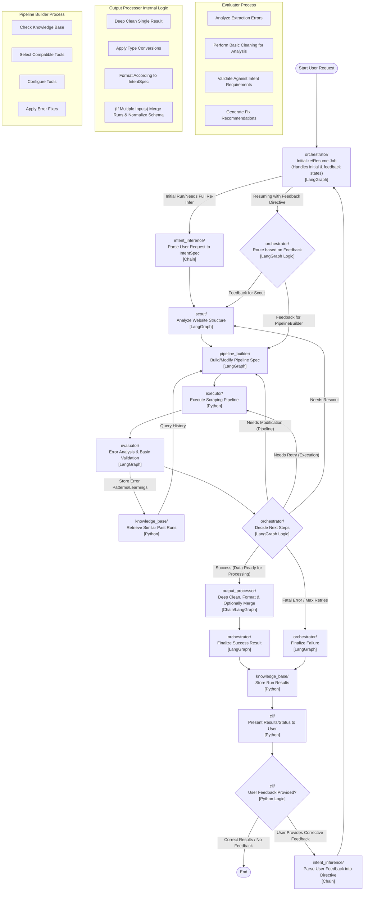

```mermaid
flowchart TD
 subgraph EvaluatorLogic["Evaluator Process"]
        E1["Analyze Extraction Errors"]
        E2["Perform Basic Cleaning for Analysis"]
        E3["Validate Against Intent Requirements"]
        E4["Generate Fix Recommendations"]
  end
 subgraph OutputProcessorLogic["Output Processor Internal Logic"]
        OP1["Deep Clean Single Result"]
        OP2["Apply Type Conversions"]
        OP3["Format According to IntentSpec"]
        OP4["(If Multiple Inputs) Merge Runs & Normalize Schema"]
  end
 subgraph PipelineBuilderLogic["Pipeline Builder Process"]
        PB1["Check Knowledge Base"]
        PB2["Select Compatible Tools"]
        PB3["Configure Tools"]
        PB4["Apply Error Fixes"]
  end
    Start(["Start User Request"]) --> Initialize["orchestrator/<br>Initialize/Resume Job<br>(Handles initial &amp; feedback states)<br>[LangGraph]"]
    Initialize -- "Initial Run/Needs Full Re-Infer" --> InferIntent["intent_inference/<br>Parse User Request to IntentSpec<br>[Chain]"]
    Initialize -- Resuming with Feedback Directive --> RouteOnFeedback{"orchestrator/<br>Route based on Feedback<br>[LangGraph Logic]"}
    InferIntent --> ScoutWebsite["scout/<br>Analyze Website Structure<br>[LangGraph]"]
    KnowledgeBase["knowledge_base/<br>Retrieve Similar Past Runs<br>[Python]"] -- "<span style=color: rgb(30, 26, 46);>Query History</span>" --> PipelineBuilder["pipeline_builder/<br>Build/Modify Pipeline Spec<br>[LangGraph]"]
    ScoutWebsite --> PipelineBuilder
    RouteOnFeedback -- Feedback for PipelineBuilder --> PipelineBuilder
    RouteOnFeedback -- Feedback for Scout --> ScoutWebsite
    PipelineBuilder --> ExecutePipeline["executor/<br>Execute Scraping Pipeline<br>[Python]"]
    ExecutePipeline --> EvaluateResults["evaluator/<br>Error Analysis &amp; Basic Validation<br>[LangGraph]"]
    EvaluateResults --> Decision{"orchestrator/<br>Decide Next Steps<br>[LangGraph Logic]"}
    Decision -- Success (Data Ready for Processing) --> OutputProcessor["output_processor/<br>Deep Clean, Format &amp; Optionally Merge<br>[Chain/LangGraph]"]
    Decision -- Needs Modification (Pipeline) --> PipelineBuilder
    Decision -- Needs Retry (Execution) --> ExecutePipeline
    Decision -- Needs Rescout --> ScoutWebsite
    Decision -- Fatal Error / Max Retries ---> FinalizeFailure["orchestrator/<br>Finalize Failure<br>[LangGraph]"]
    OutputProcessor --> FinalizeResult["orchestrator/<br>Finalize Success Result<br>[LangGraph]"]
    FinalizeResult --> StoreResult["knowledge_base/<br>Store Run Results<br>[Python]"]
    FinalizeFailure --> StoreResult
    StoreResult --> UserInteraction["cli/<br>Present Results/Status to User<br>[Python]"]
    UserInteraction --> UserFeedbackDecision{"cli/<br>User Feedback Provided?<br>[Python Logic]"}
    UserFeedbackDecision -- Correct Results / No Feedback --> End(["End"])
    UserFeedbackDecision -- User Provides Corrective Feedback --> ParseFeedback["intent_inference/<br>Parse User Feedback into Directive<br>[Chain]"]
    ParseFeedback --> Initialize
    EvaluateResults -- Store Error Patterns/Learnings --> KnowledgeBase


```

```mermaid
flowchart TD
    Start(["Start"]) --> Orchestrator{{"orchestrator/<br>Central Supervisor<br>[LangGraph]"}}
    Orchestrator --> End(["End"])
    
    Orchestrator -->|"Calls"| Intent["intent_inference/<br>Intent Parser<br>[Chain]"]
    Orchestrator -->|"Calls"| Scout["scout/<br>Website Analysis<br>[LangGraph]"]
    Orchestrator -->|"Calls"| Pipeline["pipeline_builder/<br>Pipeline Management<br>[LangGraph]"]
    Orchestrator -->|"Calls"| Executor["executor/<br>Scraping Pipeline<br>[Python]"]
    Orchestrator -->|"Calls"| Evaluator["evaluator/<br>Validation & Analysis<br>[LangGraph]"]
    Orchestrator -->|"Calls"| Output["output_processor/<br>Cleaning & Formatting<br>[Chain]"]
    
    Orchestrator -->|"Calls"| Progress["progress_tracker/<br>Execution Monitoring<br>[Python]"]
    Orchestrator -->|"Calls"| Tools["tool_registry/<br>Tool Management<br>[Python]"]
    Orchestrator -->|"Calls"| Config["config_secrets/<br>Credentials Handler<br>[Python]"]
    Orchestrator -->|"Calls"| API["api_gateway/<br>API Layer<br>[Python]"]
    
    KB[("knowledge_base/<br>Data Storage<br>[Python]")]
    Pipeline -.->|"Query"| KB
    Evaluator -.->|"Store"| KB
    
    Orchestrator -->|"Results"| UserInterface["cli/<br>User Interface<br>[Python]"]
    UserInterface -->|"Feedback"| Orchestrator
    
    subgraph OrchestratorSystem ["orchestrator/ [LangGraph]"]
        O_State["State Manager<br>Track execution context"]
        O_Router["Decision Router<br>Select next component"]
        O_Feedback["Feedback Handler<br>Process user input"]
        O_Recovery["Error Recovery<br>Handle retries"]
        
        O_State --> O_Router
        O_Feedback --> O_Router
        O_Router --> O_Recovery
        O_Recovery --> O_State
    end
    
    subgraph IntentSystem ["intent_inference/ [Chain]"]
        I_Parser["Input Parser<br>Extract requirements"]
        I_Feedback["Feedback Classifier<br>Categorize feedback"]
        I_Spec["IntentSpec Builder<br>Create specification"]
        
        I_Parser --> I_Feedback --> I_Spec
    end
    
    subgraph ScoutSystem ["scout/ [LangGraph]"]
        S_URL["URL Validator<br>Check accessibility"]
        S_Structure["Structure Analyzer<br>Identify elements"]
        S_Navigation["Navigation Mapper<br>Detect pagination"]
        S_Protection["Anti-Bot Detector<br>Identify protections"]
        
        S_URL --> S_Structure
        S_Structure --> S_Navigation
        S_Structure --> S_Protection
    end
    
    subgraph PipelineSystem ["pipeline_builder/ [LangGraph]"]
        PB_KB["Knowledge Lookup<br>Find similar patterns"]
        PB_Template["Template Selector<br>Choose base pipeline"]
        PB_Tools["Tool Configurator<br>Set parameters"]
        PB_Selectors["Selector Generator<br>Create CSS/XPath"]
        PB_Fixer["Error Fixer<br>Apply feedback"]
        
        PB_KB --> PB_Template --> PB_Tools --> PB_Selectors
        PB_Fixer --> PB_Selectors
        PB_Fixer --> PB_Template
    end
    
    subgraph ExecutorSystem ["executor/ [Python]"]
        E_Initialize["Initialize Tools<br>Set up environment"]
        E_Execute["Execute Pipeline<br>Run scraping steps"]
        E_Monitor["Monitor Execution<br>Track progress"]
        E_Capture["Capture Results<br>Store data/errors"]
        
        E_Initialize --> E_Execute --> E_Monitor --> E_Capture
    end
    
    subgraph EvaluatorSystem ["evaluator/ [LangGraph]"]
        EV_Error["Error Analyzer<br>Diagnose issues"]
        EV_Cleaner["Basic Cleaner<br>Remove artifacts"]
        EV_Validator["Data Validator<br>Check requirements"]
        EV_Scorer["Quality Scorer<br>Rate extraction"]
        EV_Recommend["Fix Recommender<br>Suggest improvements"]
        
        EV_Error --> EV_Recommend
        EV_Cleaner --> EV_Validator --> EV_Scorer --> EV_Recommend
    end
    
    subgraph OutputSystem ["output_processor/ [Chain]"]
        O_Cleaner["Deep Cleaner<br>Advanced cleaning"]
        O_Formatter["Type Converter<br>Apply formatting"]
        O_Merger["Run Merger<br>Combine results"]
        O_Final["Final Formatter<br>Structure output"]
        
        O_Cleaner --> O_Formatter
        O_Formatter -->|"Single run"| O_Final
        O_Formatter -->|"Multiple runs"| O_Merger --> O_Final
    end
    
    subgraph ProgressSystem ["progress_tracker/ [Python]"]
        PT_Init["Initialize Tracking<br>Create job record"]
        PT_Update["Update Status<br>Log progress"]
        PT_Store["Store Metrics<br>Record timing"]
        PT_Report["Generate Reports<br>Create summaries"]
        
        PT_Init --> PT_Update --> PT_Store --> PT_Report
    end
    
    subgraph ToolSystem ["tool_registry/ [Python]"]
        TR_Load["Load Tools<br>Import libraries"]
        TR_Catalog["Catalog Tools<br>Define capabilities"]
        TR_Provide["Provide Access<br>Make tools available"]
        
        TR_Load --> TR_Catalog --> TR_Provide
    end
    
    subgraph ConfigSystem ["config_secrets/ [Python]"]
        CS_Load["Load Config<br>Read settings"]
        CS_Secure["Secure Credentials<br>Handle secrets"]
        CS_Provide["Provide Access<br>Secure distribution"]
        
        CS_Load --> CS_Secure --> CS_Provide
    end
    
    subgraph APISystem ["api_gateway/ [Python]"]
        API_Route["Route Requests<br>Handle endpoints"]
        API_Auth["Authenticate<br>Verify identity"]
        API_Transform["Transform Data<br>Format for clients"]
        
        API_Auth --> API_Route --> API_Transform
    end
    
    subgraph KBSystem ["knowledge_base/ [Python]"]
        KB_Store["Store Results<br>Save data"]
        KB_Index["Index Content<br>Make searchable"]
        KB_Retrieve["Retrieve Patterns<br>Find matches"]
        KB_Update["Update Patterns<br>Learn from runs"]
        
        KB_Store --> KB_Index
        KB_Retrieve --> KB_Update
    end
    
    subgraph UISystem ["cli/ [Python]"]
        UI_Command["Command Parser<br>Process inputs"]
        UI_Display["Results Display<br>Format output"]
        UI_Feedback["Feedback Collector<br>Gather user input"]
        
        UI_Command --> UI_Display --> UI_Feedback
    end
    
    classDef mainNode fill:#f5f5f5,stroke:#333,stroke-width:2px;
    classDef orchestratorNode fill:#d0f0c0,stroke:#333,stroke-width:2px;
    classDef langGraphNode fill:#d0e0f0,stroke:#333,stroke-width:2px;
    classDef chainNode fill:#f0e0d0,stroke:#333,stroke-width:2px;
    classDef pythonNode fill:#f0d0e0,stroke:#333,stroke-width:2px;
    classDef kbNode fill:#f0f0d0,stroke:#333,stroke-width:2px;
    
    class Start,End mainNode
    class Orchestrator orchestratorNode
    class Scout,Pipeline,Evaluator langGraphNode
    class Intent,Output chainNode
    class Executor,Progress,Tools,Config,API,UserInterface pythonNode
    class KB kbNode

```